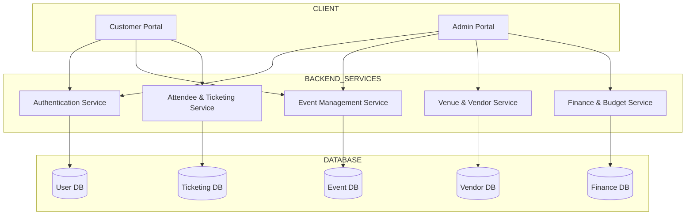
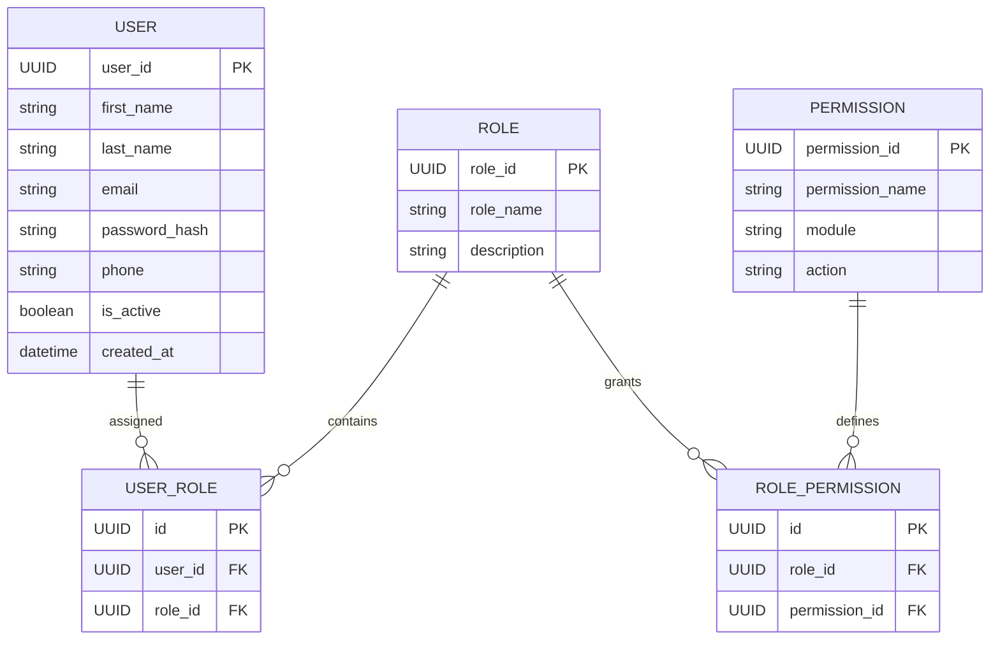
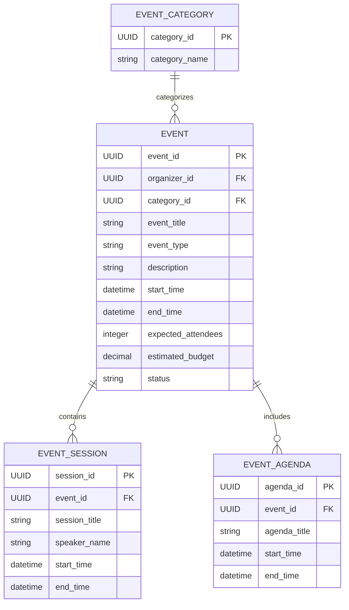
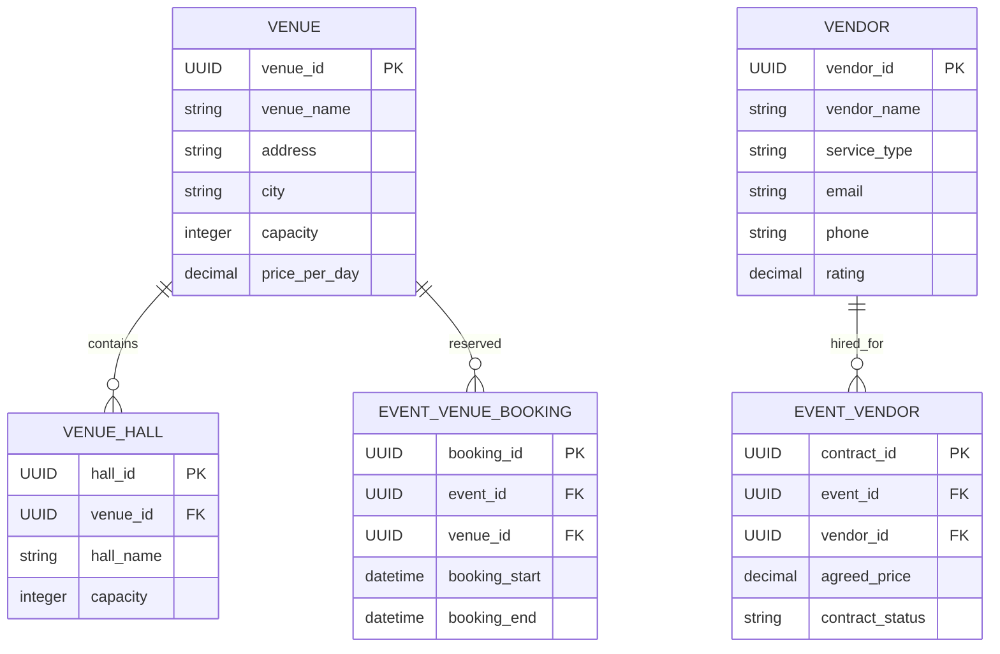
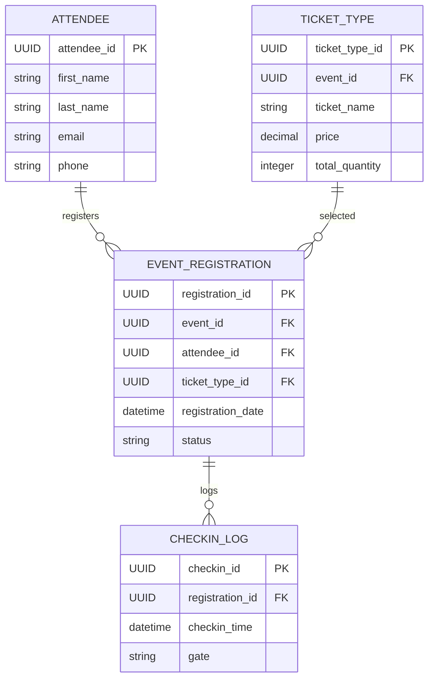
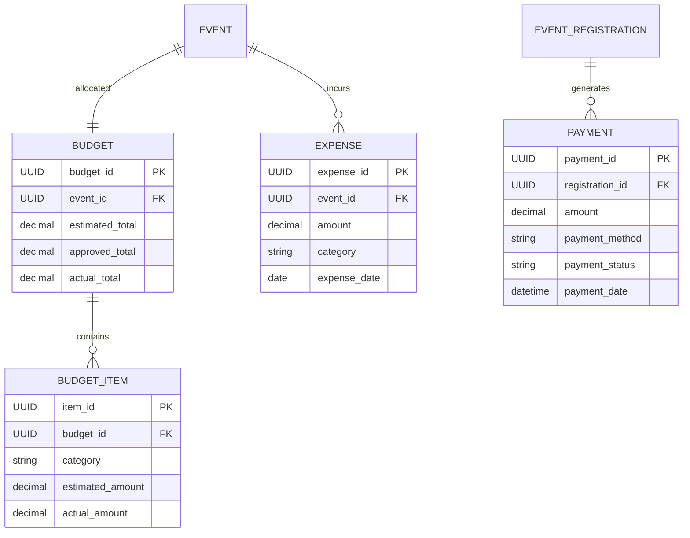

# EventZen Event Management System

## System Architecture and ERD Documentation

This document presents the **system architecture and database design** for the **EventZen Event Management System**. The architecture is designed to support scalable event planning operations including event scheduling, vendor coordination, attendee registration, and financial management.

The system is organized into modular components to improve maintainability, scalability, and clarity of the system design.

The architecture includes:

- Top-level system architecture
- Five functional modules
- Clearly defined service boundaries
- Logical grouping of database entities

---

# System Architecture

This architecture separates the application into **frontend portals, backend services, and service-specific databases**, enabling independent scaling and modular development.

---

# Modules

The system is divided into five primary modules:

1. Authentication & User Management
2. Event Management
3. Venue & Vendor Management
4. Attendee & Ticketing
5. Finance & Budget Management

Each module is expandable below to view its detailed **ER diagram**.

---

<strong>Authentication & User Management Module</strong>

This module manages **users, authentication, and role-based authorization**.

---

<strong>Event Management Module</strong>

This module manages **event creation, scheduling, and agenda management**.

---

<strong>Venue & Vendor Management Module</strong>

This module handles **venue reservations and vendor service management**.

---

<strong>Attendee & Ticketing Module</strong>

This module manages **attendee registrations, ticket purchases, and check-in tracking**.

---

<strong>Finance & Budget Management Module</strong>

This module manages **budget planning, payments, and expense tracking**.

---

# Final System Structure

| Module               | Purpose                                     |
| -------------------- | ------------------------------------------- |
| Authentication       | User authentication, roles, and permissions |
| Event Management     | Event creation, sessions, and scheduling    |
| Venue & Vendor       | Venue booking and vendor services           |
| Attendee & Ticketing | Registration, ticketing, and check-ins      |
| Finance & Budget     | Budget tracking, payments, and expenses     |

---

# Design Characteristics

The proposed system design demonstrates:

* Modular architecture
* Scalable microservice-oriented structure
* Normalized database schema
* Clear separation of concerns
* Real-world event management workflow support

